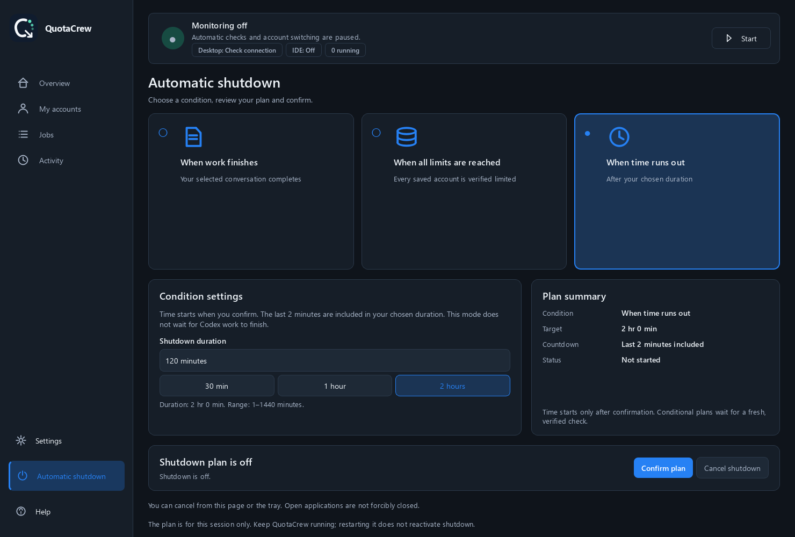

<div align="center">

<a href="https://github.com/erkanpulat/codex-quotacrew/releases/latest"></a>

# QuotaCrew for Codex

**Switch accounts. Keep work moving.**

Your Codex accounts, remaining quotas and ongoing work in one window.

**[Download for Windows](https://github.com/erkanpulat/codex-quotacrew/releases/latest)** · [How it works](#continuation-flow) · [Get started](#get-started) · [Türkçe](README.tr.md)

Windows · English / Türkçe · Light & dark themes · MIT

</div>

<a href="https://github.com/erkanpulat/codex-quotacrew/releases/latest">
<picture>
  <source media="(prefers-color-scheme: dark)" srcset="docs/images/overview-dark.png">
  <source media="(prefers-color-scheme: light)" srcset="docs/images/overview-light.png">
  
</picture>
</a>

*The actual application with sample accounts. Click the image to open Windows downloads.*

## Less account juggling, more time for your work

When a usage limit interrupts a task, finding an available account and returning to the right conversation takes time. **QuotaCrew brings those steps together:** compare quotas, choose how accounts switch, and request continuation of eligible conversations in Codex Desktop or VS Code.

- **See your accounts at a glance.** Five-hour and weekly capacity, quota reset times, the active account and reset credits share one table. Overview and My accounts share search, filters, sorting and email-hiding controls, including subscription-period sorting.
- **Choose how you switch.** Change accounts yourself, approve a suggestion or enable automatic switching to an available account when a limit is reached.
- **Continue in the same conversation.** A continuation request carries the existing goal and instructions back to the interrupted conversation.
- **Follow work and its results.** Jobs, Activity and the system tray show monitoring, continuation preferences and verified running-work counts.
- **Fit your working routine.** Run in the tray, start with Windows or schedule shutdown when your chosen condition is met.

The plan badge can also show the subscription-period date recorded at sign-in when matching metadata is available. Hover over it for the last check and source; this is not a confirmed renewal or cancellation date.

## Continuation flow

With monitoring and the relevant continuation option enabled, QuotaCrew detects a quota-interrupted task and checks the destination account. After switching, it sends a continuation request to **the same conversation** and tracks the new turn in Jobs.


Accounts and conversations are checked again during the handoff. Depending on the monitoring interval and application startup time, this can take a few minutes. The existing goal, instructions and budget stay in place; approval steps remain under your control. A problem in one independent conversation does not prevent other eligible conversations from continuing.

> **About continuation:** Automatic Desktop and IDE continuation is experimental and depends on the connection support in your installed Codex version. QuotaCrew sends a request after verifying eligible work and its conversation connection; it reports when approval or a user response is needed.

<details>
<summary>The continuation request and connection details</summary>

The request asks Codex to continue unfinished work with the existing goal, permissions and budget, avoid repeating completed work, and stop if user input is needed. It is new model input and can consume quota.

Desktop's native relay may label the message as sent by ChatGPT from another task. The request goes to the existing conversation. **Jobs → row menu → Automatic continuation details** shows preparation, submission and the observed result separately.

Desktop uses its native local channel, IDE continuation connects to the existing Codex owner over Windows IPC, and supported CLI conversations use App Server JSON-RPC. [Technical flow and goal behavior](docs/continuity.md).

</details>

## VS Code continuation

You can use Codex Desktop and VS Code together. In VS Code, install **OpenAI's Codex extension** and open your conversation through that extension.


*AI-generated illustration of the continuation flow; this is not a live test screenshot.*

1. Open your local project and its Codex conversation in VS Code.
2. In QuotaCrew, enable **Settings → Conversations → IDE continuation**.
3. If the extension needs to reload the new account session, also enable **Refresh VS Code after switching**. This closes the single local VS Code window, then reopens the interrupted conversation's workspace and that same conversation.
4. If VS Code asks permission to open the conversation link, choose **Open**. Respond to save prompts and other approval requests yourself.

<details>
<summary>Continuation settings and supported environments</summary>


| Environment | Use |
| --- | --- |
| Codex Desktop | Account switching and conversation continuation in the packaged Windows app. |
| Local VS Code | Continuation through the Codex extension; automatic refresh supports one local window. |
| CLI / App Server | Continuation for supported local conversations. |
| Cursor / Windsurf | Open project folders and connect to local owners; automatic refresh has not been verified. |
| Remote / WSL / cloud / another device | Outside the local IDE continuation scope. |

QuotaCrew does not install a VS Code extension. **Open project in editor** opens a folder; **Check continuation support** checks the conversation connection without sending input.

</details>

## Get started

[](https://github.com/erkanpulat/codex-quotacrew/releases/latest)

**Python included · No Node.js required · Existing Codex history preserved**

1. **Download and open.** Get `QuotaCrew-Setup-0.2.4.exe` from the [latest release](https://github.com/erkanpulat/codex-quotacrew/releases/latest) and install it. For portable use, extract the entire ZIP into a folder and open `QuotaCrew.exe`.
2. **Choose your preferences.** The first-run assistant introduces monitoring, switching, continuation and tray options. If Codex CLI is missing, it offers the official Windows installation with your consent; an existing CLI installation is preserved.
3. **Add your accounts.** Open **My accounts → Add account** and give the account a recognizable name. Complete sign-in in the terminal and default browser that open. You can copy the terminal’s sign-in link into another browser; keep the terminal open until QuotaCrew confirms the account was linked.

<details>
<summary>First-run screens and default preferences</summary>


New installations select monitoring and automatic account switching. You can change preferences during setup or later in **Settings**. Switching restarts Codex Desktop; save your work first.

Enable **Keep running in the tray** to continue monitoring after closing the window. **Pause** stops automatic switching, work tracking and continuation; account information continues refreshing at the configured interval (60 seconds by default). Starting with Windows is a separate preference. A cancelled sign-in can be retried from the account's actions menu.

Windows packages are not code-signed. `SHA256SUMS.txt` contains the release file checksums.

</details>

## Keep track of your work

**Jobs** brings conversations, their accounts, work status and last-check times together. Select a row to inspect its Codex goal or continuation details. **Activity** shows the latest 50 account-switch results.

<picture>
  <source media="(prefers-color-scheme: dark)" srcset="docs/images/jobs-dark-tr.png">
  
</picture>

Search local conversations by project, source, title or folder and open the project in your editor. `Ctrl+F` focuses search; `Ctrl+R` refreshes the page. **Clear tracking** clears QuotaCrew's observations and pauses monitoring; it preserves Codex conversation history. Stop a running conversation with Codex's own **Stop** action.

**Automatic shutdown** gives you three clear choices: finish a selected conversation, exhaust every saved account’s verified five-hour quota with no available account to switch to, or shut down after a set time. Work and limit conditions start a fixed **2-minute cancellation countdown** once verified and no other Codex work is active. The timer accepts **1–1440 minutes** (120 = two hours), including the final warning, and does not wait for work to finish. Plans require confirmation, last only for the current session and never forcibly close applications. [Shutdown conditions](docs/continuity.md#optional-windows-shutdown).



<details>
<summary>Conversation history, account creation and reset credits</summary>


Archived, cloud-only and other-device conversations are excluded from the local list. Reading a Codex goal and saving a local goal note do not start model work. Shutdown waits if fresh evidence is unavailable or other observed work is running; quitting cancels the plan.

</details>

## Updates

Installed copies check for newer stable releases once a day when automatic checks are enabled. Open **Settings → Updates**, read the release notes and choose **Update**: the package downloads, its size and SHA-256 are checked, data is backed up and only QuotaCrew restarts. Installation waits for active account operations or pending continuation to finish.

<details>
<summary>The update screen and keeping packages tidy</summary>


Old downloads are cleaned up, bundled dependencies are replaced, and at most two update database backups are retained. Portable and source installations are updated manually from the release page.

To offer users an update, publish a higher-version stable GitHub Release with its Windows installer. [Maintainer release steps](packaging/README.md#publishing-updates).

</details>

## Data and privacy

Account profiles, settings and tracking records stay on your computer. Existing conversations remain in the shared `~/.codex` home; installation, updates and uninstalling QuotaCrew preserve that history. **System check** shows the data locations.

QuotaCrew has no telemetry or credential proxy. Codex connects to OpenAI for sign-in and account information. On Windows, saved profile credentials and account-switch recovery data are encrypted with user-scoped DPAPI. A profile is temporarily decrypted while its Codex process runs; interrupted sessions are protected again on recovery. The shared Codex credential file and local SQLite metadata remain unencrypted with restricted access permissions. Diagnostic exports exclude credentials, databases and conversation text. Email addresses can be hidden in the interface. [Security and data protection](SECURITY.md).

## Development and contributions

QuotaCrew is open source. Share ideas through [Issues](https://github.com/erkanpulat/codex-quotacrew/issues), contribute improvements through a [pull request](https://github.com/erkanpulat/codex-quotacrew/pulls), or [star the project](https://github.com/erkanpulat/codex-quotacrew) if it helps your workflow.

<details>
<summary>Source setup, CLI and developer checks</summary>

Requires Python 3.11–3.13 and Git. In PowerShell:

```powershell
git clone https://github.com/erkanpulat/codex-quotacrew.git
cd codex-quotacrew
./scripts/bootstrap.ps1
.venv/Scripts/quotacrew.exe
```

Bootstrap also creates desktop and Start menu shortcuts. Rerun it from the new location if you move the checkout. Alternatively, in an activated virtual environment:

```powershell
python -m pip install -e ".[gui]"
codex-accounts init
codex-accounts gui
```

For the CLI, `cx` is a short alias for `codex-accounts`. Run `codex-accounts --help` for all options.

```powershell
codex-accounts profile add work
codex-accounts profile login work
codex-accounts accounts
codex-accounts switch work
codex-accounts doctor --bundle
```

Developer checks:

```powershell
python -m pip install -e ".[gui,dev]"
python -m ruff check src tests scripts
python -m ruff format --check src tests scripts
python -m mypy src
python -m pytest -q
```

Tests isolate account data and Codex connections; GUI tests run offscreen. `python scripts/render_preview.py` captures the actual interface with sample accounts. CI runs code, dependency, security and package checks on Windows/Linux and Python 3.11–3.13.

</details>

[Architecture and contributing](CONTRIBUTING.md) · [Windows packaging](packaging/README.md) · [Manual tests, including IDE](docs/manual-testing.tr.md) · [Troubleshooting](docs/troubleshooting.md) · [Changelog](CHANGELOG.md)

MIT-licensed independent community software, not affiliated with or endorsed by OpenAI. OpenAI and Codex are OpenAI trademarks. QuotaCrew does not increase account quotas; use your accounts in accordance with applicable service terms.
