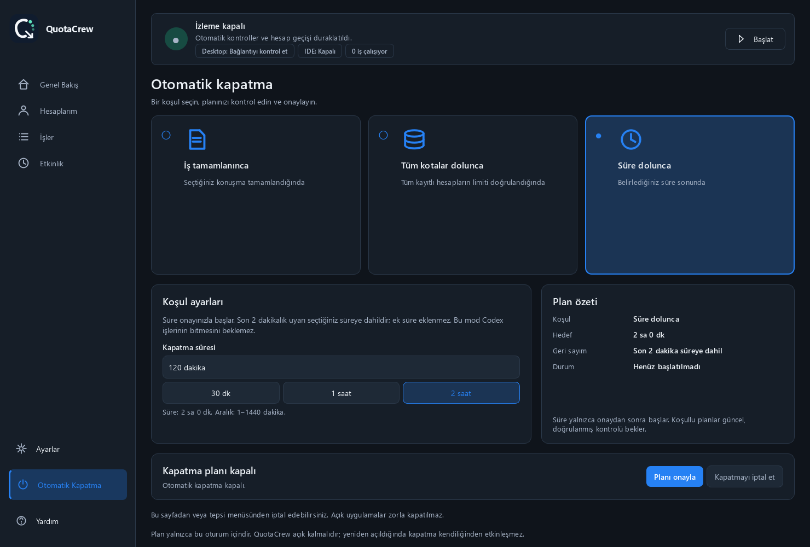

<div align="center">

<a href="https://github.com/erkanpulat/codex-quotacrew/releases/latest"></a>

# QuotaCrew for Codex

**Hesap değişsin, iş devam etsin.**

Codex hesaplarınız, kalan kotalarınız ve devam eden işleriniz tek pencerede.

**[Windows için indir](https://github.com/erkanpulat/codex-quotacrew/releases/latest)** · [Nasıl çalışır?](#devam-akışı) · [Kurulum](#kurulum) · [English](README.md)

Windows · Türkçe / English · Açık ve koyu tema · MIT

</div>

[](https://github.com/erkanpulat/codex-quotacrew/releases/latest)

*Gerçek uygulama ekranı; hesap bilgileri örnektir. Görsele tıklayarak indirme sayfasını açabilirsiniz.*

## Hesap değiştirmeye daha az, işinize daha çok zaman

Bir işin ortasında limit dolduğunda, hangi hesabın kullanılabilir olduğunu bulmak ve yarım kalan sohbete dönmek zaman alır. **QuotaCrew bu adımları tek yerde toplar:** kotaları karşılaştırın, hesap geçişini nasıl yapacağınızı seçin ve Codex Desktop ya da VS Code'daki uygun konuşmaların kaldığı yerden devam etmesini sağlayın.

- **Hesaplarınızı tek bakışta görün.** Beş saatlik ve haftalık kalan kota, yenilenme zamanı, etkin hesap ve sıfırlama hakları aynı tabloda.
- **Geçişin kontrolü sizde olsun.** Hesabı kendiniz değiştirin, uygulama önerdiğinde onaylayın veya limit dolduğunda kullanılabilir bir hesaba otomatik geçişi açın.
- **Yarım kalan işi aynı sohbette sürdürün.** Devam isteği, mevcut hedefi ve talimatları koruyarak kesilen konuşmaya gönderilir.
- **İşleri ve sonuçlarını takip edin.** İşler, Etkinlik ve sistem tepsisi; izleme durumunu, devam tercihlerini ve doğrulanmış çalışan iş sayısını gösterir.
- **Çalışma düzeninizi seçin.** Tepside çalıştırın, Windows ile başlatın veya belirlediğiniz koşul gerçekleştiğinde bilgisayarın kapanmasını planlayın.

Plan rozeti, eşleşen bilgi mevcutsa giriş sırasında kaydedilen abonelik dönemi tarihini de gösterir. Son kontrol ve kaynak açıklaması için üzerine gelin; bu tarih kesin yenileme veya iptal bilgisi değildir.

## Devam akışı

İzleme ve ilgili devam seçeneği açıkken QuotaCrew, kota nedeniyle kesilen işi algılar ve kullanılabilir hesabı kontrol eder. Geçişin ardından **aynı konuşmaya** bir devam isteği gönderir; yeni turun durumunu takip ederek sonucu İşler sayfasında gösterir.


Geçiş sırasında hesaplar ve konuşmalar yeniden kontrol edilir. Kontrol aralığına ve uygulamaların açılma süresine bağlı olarak bu işlem birkaç dakika sürebilir. Hedef, talimatlar ve bütçe korunur; kullanıcı onayı gereken adımlar sizin kontrolünüzde kalır. Bağımsız bir konuşmadaki sorun, diğer uygun konuşmaların devamını engellemez.

> **Devam özelliği hakkında:** Desktop ve IDE'de otomatik devam, deneyseldir ve kurulu Codex sürümünün bağlantı desteğine bağlıdır. Uygulama, devam gerektiren işi ve konuşma bağlantısını doğruladığında istek gönderir; onay veya kullanıcı yanıtı gerekiyorsa bunu bildirir.

<details>
<summary>Devam isteği ve bağlantıların teknik ayrıntıları</summary>

Gönderilen talimat, mevcut hedefi, izinleri ve bütçeyi koruyarak yarım kalan işe devam edilmesini; tamamlanan işin tekrarlanmamasını ve kullanıcı girdisi gerekiyorsa durulmasını ister. Bu, yeni bir model girdisidir ve kota tüketebilir.

Desktop'ın yerel iletim kanalı nedeniyle mesajın üzerinde “ChatGPT tarafından başka bir görevden gönderildi” yazabilir. İstek mevcut konuşmaya gönderilir. **İşler → satır menüsü → Otomatik devam ayrıntıları** bölümünde hazırlık, gönderim ve gözlenen sonuç ayrı ayrı görülebilir.

Desktop kendi yerel kanalını, IDE mevcut Codex oturumuna Windows IPC bağlantısını, desteklenen CLI konuşmaları ise App Server JSON-RPC bağlantısını kullanır. [Teknik akış ve hedef davranışı](docs/continuity.md).

</details>

## VS Code ile devam

Codex Desktop ve VS Code'u birlikte kullanabilirsiniz. VS Code tarafında **OpenAI Codex eklentisi** kurulu olmalı ve konuşma bu eklenti üzerinden açılmalıdır.


*Devam akışını anlatan, yapay zekâ ile hazırlanmış temsili görsel; canlı test ekranı değildir.*

1. Yerel projenizi ve Codex konuşmasını VS Code'da açın.
2. QuotaCrew'de **Ayarlar → Konuşmalar → IDE'de devam** seçeneğini açın.
3. Eklentinin yeni hesapla oturumunu yenilemesi gerekiyorsa **Geçişten sonra VS Code’u yenile** seçeneğini de açın. Bu seçenek, tek yerel VS Code penceresini kapatıp kesilen sohbetin çalışma klasörünü ve aynı konuşmayı yeniden açar.
4. VS Code konuşma bağlantısını açmak için onay isterse **Aç** seçeneğini kullanın. Kaydetme ve diğer onay sorularını siz yanıtlayın.

<details>
<summary>Devam ayarları ve desteklenen ortamlar</summary>


| Ortam | Kullanım |
| --- | --- |
| Codex Desktop | Paketli Windows uygulamasında hesap geçişi ve sohbet devamı. |
| Yerel VS Code | Codex eklentisinde sohbet devamı; otomatik yenileme tek yerel pencereyi destekler. |
| CLI / App Server | Desteklenen yerel konuşmalarda devam. |
| Cursor / Windsurf | Proje klasörünü açma ve yerel oturum bağlantısı; otomatik yenileme doğrulanmamıştır. |
| Remote / WSL / bulut / başka cihaz | Yerel IDE devamı kapsamı dışındadır. |

QuotaCrew bir VS Code eklentisi yüklemez. **Projeyi editörde aç** klasörü açar; **Devam desteğini kontrol et** mesaj göndermeden konuşmanın bağlantısını kontrol eder.

</details>

## Kurulum

[](https://github.com/erkanpulat/codex-quotacrew/releases/latest)

**Python pakete dahil · Node.js gerekmez · Mevcut Codex sohbetleriniz korunur**

1. **İndirin ve açın.** [Son sürüm](https://github.com/erkanpulat/codex-quotacrew/releases/latest) sayfasından `QuotaCrew-Setup-0.2.3.exe` dosyasını indirip kurun. Taşınabilir kullanım için ZIP'in tamamını bir klasöre çıkarın ve `QuotaCrew.exe` dosyasını açın.
2. **Tercihlerinizi seçin.** İlk açılış yardımcısı izleme, hesap geçişi, sohbet devamı ve tepsi seçeneklerini tanıtır. Codex CLI eksikse onayınızla resmî Windows kurulumunu başlatır; mevcut CLI kurulumunuzu korur.
3. **Hesaplarınızı ekleyin.** **Hesaplarım → Hesap ekle** bölümünde hesabınıza bir ad verin. Açılan terminal ve varsayılan tarayıcıda girişinizi tamamlayın; ardından diğer hesaplarınızı ekleyip kotaları yenileyin.

<details>
<summary>İlk açılış ekranları ve varsayılan tercihler</summary>


Yeni kurulumlarda izleme ve otomatik hesap geçişi seçilidir. Tercihlerinizi ilk açılışta ve daha sonra **Ayarlar**'da değiştirebilirsiniz. Hesap geçişi Codex Desktop'ı yeniden başlatır; çalışmalarınızı kaydedin.

Pencere kapandıktan sonra izlemenin sürmesi için **Tepside çalışmaya devam et** seçeneğini açın. **Duraklat**, izlemeyi ve QuotaCrew'ün devam işlemlerini durdurur. Windows ile başlatma ayrı bir tercihtir. İptal edilen hesap girişini ilgili hesabın işlem menüsünden yeniden başlatabilirsiniz.

Windows paketleri kod imzalı değildir. `SHA256SUMS.txt`, sürüm dosyalarının doğrulama değerlerini içerir.

</details>

## İşlerinizi gözden kaçırmayın

**İşler** sayfasında konuşmaları, bağlı hesapları, çalışma durumlarını ve son kontrol zamanlarını birlikte görün. Bir işi seçerek Codex hedefini veya devam işleminin ayrıntılarını açın. **Etkinlik** sayfasında hesap geçişlerinin ve işlemlerin sonuçlarını takip edin.

<picture>
  <source media="(prefers-color-scheme: dark)" srcset="docs/images/jobs-dark-tr.png">
  
</picture>

Yerel konuşmalarınızı proje, kaynak, başlık veya klasöre göre arayın; ilgili projeyi editörünüzde açın. `Ctrl+F` aramaya odaklanır, `Ctrl+R` sayfayı yeniler. **Takibi temizle**, QuotaCrew'ün takip kayıtlarını temizleyip izlemeyi duraklatır; Codex sohbet geçmişinizi silmez. Çalışan bir konuşmayı durdurmak için Codex'in **Durdur** düğmesini kullanın.

**Otomatik Kapatma** için üç seçenek vardır: seçtiğiniz iş tamamlandığında, tüm kayıtlı hesapların kullanılabilir limitleri dolduğunda veya belirlediğiniz süre sonunda. İş ve limit koşulları doğrulanıp başka bir Codex işinin çalışmadığı görüldüğünde **2 dakikalık iptal edilebilir geri sayım** başlar. Süreli modda **1–1440 dakika** seçebilirsiniz (120 dakika = iki saat); son uyarı bu süreye dahildir ve işlerin bitmesi beklenmez. Planlar onayınızla açılır, yalnızca o oturumda geçerlidir ve açık uygulamaları zorla kapatmaz. [Kapatma koşulları](docs/continuity.md#optional-windows-shutdown).



<details>
<summary>Konuşma geçmişi, hesap ekleme ve sıfırlama hakları</summary>


Arşivlenmiş, yalnızca bulutta veya başka cihazda bulunan konuşmalar yerel listede gösterilmez. Codex hedefini okumak ve yerel hedef notu kaydetmek model çalıştırmaz. İş ve limit modlarında güncel durum doğrulanamıyorsa veya başka bir iş sürüyorsa kapatma bekler; uygulamadan çıkmak kapatma planını iptal eder.

</details>

## Güncellemeler

Kurulu uygulama, otomatik kontrol açıkken yeni kararlı sürümleri günde bir kontrol eder. **Ayarlar → Güncellemeler** bölümünden sürüm notlarını inceleyip **Güncelle**'ye basın: paket indirilir, boyutu ve SHA-256 değeri doğrulanır, veriler yedeklenir ve yalnızca QuotaCrew yeniden başlar. Hesap işlemleri veya bekleyen devam işlemleri varsa kurulum ertelenir.

<details>
<summary>Güncelleme ekranı ve paketlerin temiz tutulması</summary>


Eski indirmeler temizlenir, paket bağımlılıkları yenilenir ve en fazla iki güncelleme veritabanı yedeği tutulur. Taşınabilir ve kaynak kurulumları sürüm sayfasından elle güncellenir.

Kullanıcılara güncelleme sunmak için daha yüksek numaralı kararlı bir GitHub Release ve Windows kurulum paketi yayımlanmalıdır. [Yayın adımları](packaging/README.md#publishing-updates).

</details>

## Veriler ve gizlilik

Hesap profilleri, ayarlar ve takip kayıtları bilgisayarınızda saklanır. Mevcut Codex sohbetleriniz ortak `~/.codex` klasöründe kalır; kurulum, güncelleme ve uygulamayı kaldırma bu geçmişi silmez. Veri konumlarını **Sistem Kontrolü** bölümünden görebilirsiniz.

QuotaCrew telemetri toplamaz veya giriş bilgilerinizi kendi sunucusuna göndermez. Codex, giriş ve hesap bilgileri için OpenAI'a bağlanır. Windows'ta kayıtlı profil giriş bilgileri ve hesap geçişi kurtarma verileri kullanıcıya bağlı DPAPI ile şifrelenir. Codex süreci çalışırken profil geçici olarak çözülür; kesintiden kalan dosyalar kurtarma sırasında yeniden korunur. Ortak Codex giriş dosyası ve yerel SQLite metadata'sı erişim izinleriyle korunur, şifrelenmez. Tanılama dışa aktarımı giriş bilgilerini, veritabanını ve konuşma metnini içermez. E-posta adreslerini arayüzde gizleyebilirsiniz. [Güvenlik ve veri koruma](SECURITY.md).

## Geliştirme ve katkı

QuotaCrew açık kaynaklıdır. Fikirlerinizi [Issues](https://github.com/erkanpulat/codex-quotacrew/issues) üzerinden paylaşın, geliştirmelerinizi [pull request](https://github.com/erkanpulat/codex-quotacrew/pulls) ile gönderin. İşinize yaradıysa [projeye yıldız vererek](https://github.com/erkanpulat/codex-quotacrew) destek olabilirsiniz.

<details>
<summary>Kaynaktan kurulum, CLI ve geliştirici kontrolleri</summary>

Python 3.11–3.13 ve Git gerekir. PowerShell'de:

```powershell
git clone https://github.com/erkanpulat/codex-quotacrew.git
cd codex-quotacrew
./scripts/bootstrap.ps1
.venv/Scripts/quotacrew.exe
```

Kurulum betiği masaüstü ve Başlat menüsü kısayollarını da oluşturur. Projeyi taşırsanız betiği yeni konumdan yeniden çalıştırın. Alternatif olarak etkin sanal ortamda:

```powershell
python -m pip install -e ".[gui]"
codex-accounts init
codex-accounts gui
```

CLI için `cx`, `codex-accounts` komutunun kısa adıdır. Tüm seçenekleri `codex-accounts --help` ile görebilirsiniz.

```powershell
codex-accounts profile add work
codex-accounts profile login work
codex-accounts accounts
codex-accounts switch work
codex-accounts doctor --bundle
```

Geliştirici kontrolleri:

```powershell
python -m pip install -e ".[gui,dev]"
python -m ruff check src tests scripts
python -m ruff format --check src tests scripts
python -m mypy src
python -m pytest -q
```

Testler hesap verilerini ve Codex bağlantılarını yalıtır; arayüz testleri ekran dışında çalışır. `python scripts/render_preview.py`, gerçek arayüzü örnek hesaplarla görselleştirir. CI; Windows/Linux ve Python 3.11–3.13 üzerinde kod, bağımlılık, güvenlik ve paket kontrollerini çalıştırır.

</details>

[Katkı ve mimari](CONTRIBUTING.md) · [Windows paketleme](packaging/README.md) · [IDE dahil test rehberi](docs/manual-testing.tr.md) · [Sorun giderme](docs/troubleshooting.md) · [Değişiklikler](CHANGELOG.md)

MIT lisanslı bağımsız topluluk yazılımıdır; OpenAI ile bağlantılı veya OpenAI tarafından onaylanmış değildir. OpenAI ve Codex, OpenAI'ın ticari markalarıdır. QuotaCrew hesap kotalarını artırmaz; hesaplarınızı geçerli hizmet koşullarına uygun kullanın.
